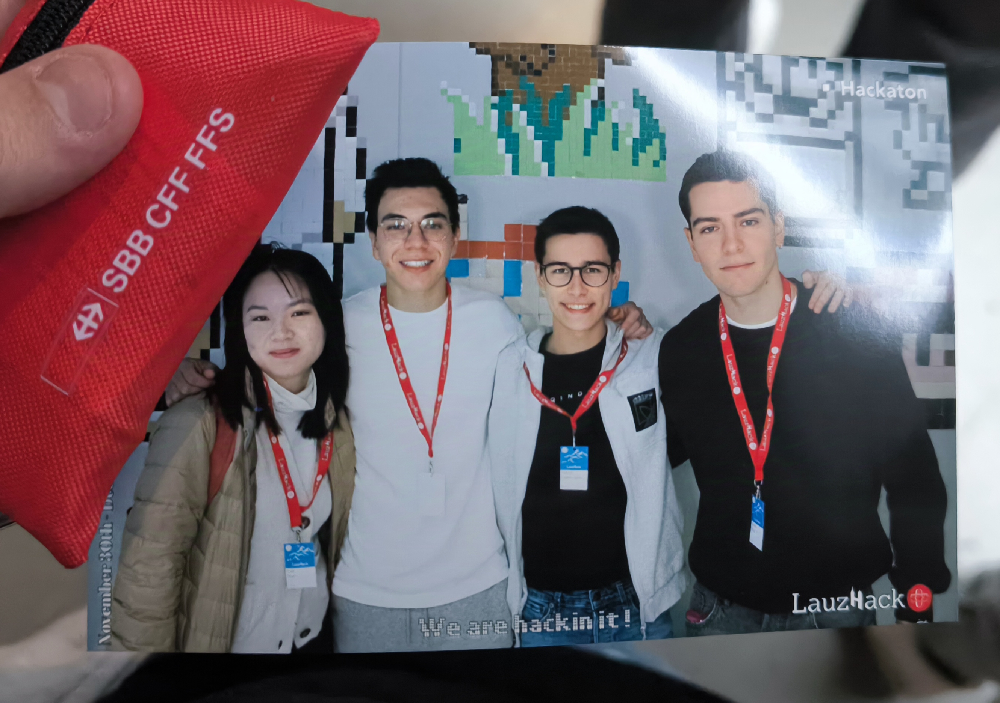

# UBS Entity Resolution - Lauzhack 2024
## Dignity Team

- Daniel López Gala - daniel.lopezgala@epfl.ch 
- Carlos Hurtado - carloshurtadocomin@gmail.com 
- Mario Rico Ibáñez - mario.ricoibanez@epfl.ch
- Tran Huong Lan - tranhuonglantk@gmail.com

Kaggle Team Name: *Dignity*



---

This project focuses on resolving financial entities by leveraging Local Sensitive Hashing (LSH) to efficiently identify and match similar non-UBS entities in transaction records. It is tailored for the financial industry, where precision and scalability are very important.

## Key Features

### Linear Models for Financial Entity Matching
The system uses LSH for blocking and similarity-based feature engineering, making it linear in terms of complexity:
- **Scalability**: LSH reduces the number of pairwise comparisons, enabling linear performance relative to data size.
- **Robustness**: Features like phonetic encoding (Soundex, Metaphone, NYSIIS), company detection, and custom similarity metrics make the model highly adaptable to diverse financial datasets.

These methods ensure quick and accurate matching, making the approach ideal for financial transactions where entity resolution needs to be precise, scalable, and interpretable.

### Workflow
1. **Preprocessing**  
   - Standardizes input datasets by normalizing names, addresses, and phone numbers.
   - Maps categorical variables into numerical formats.

2. **Feature Engineering**  
   - Extracts and encodes phonetic features for entity matching.
   - Identifies companies using keyword-based detection.
   - Splits names into "given_name" and "surname," enabling nuanced comparisons.

3. **LSH for Blocking**  
   - Employs LSH to group similar entities into buckets, reducing the number of comparisons needed.

4. **Similarity Scoring**  
   - Combines phonetic encoding, string similarity (Jaro-Winkler), and attribute weighting for fine-grained matching.

5. **Evaluation**  
   - Measures performance using precision, recall, and F1-score.

## Models Used
### Local Sensitive Hashing (LSH)
- **Blocking**: Groups entities based on attributes like names, addresses, and phone numbers using n-grams and MinHash.
- **Efficiency**: Significantly reduces computational costs by limiting comparisons to similar buckets.

### Phonetic Encodings
- **Soundex, Metaphone, NYSIIS**: Improve matching accuracy for noisy and diverse name datasets.
- **Adaptability**: Handles variations in spelling and cultural differences in entity names.

### String Similarity
- **Jaro-Winkler Distance**: Computes robust similarity scores for attributes like names and phone numbers.
- **Attribute Weighting**: Prioritizes key attributes (e.g., IBAN, surname) to align with financial data resolution requirements.

## Preprocessing Steps
- Lowercase normalization and removal of special characters.
- Title stripping for names (e.g., "Dr.", "Mr.").
- Standardized phone numbers.

## How to Run
1. Place input files in the `data/` directory:
   - `account_booking_train.csv`
   - `external_parties_train.csv`
   - `account_booking_test.csv`
   - `external_parties_test.csv`

2. Run the main script:
   ```bash
   python main.py
   ```

3. Processed files will be saved in the `data/processed/` directory, including:
   - `external_parties_train.csv`
   - `submission.csv`

## Evaluation Metrics
- **Precision**: Proportion of correctly identified pairs.
- **Recall**: Coverage of true matches.
- **F1-Score**: Harmonizes precision and recall.

## Why This Approach Works for Financial Entity Matching
- **Linear Scalability**: Handles large datasets efficiently, crucial for financial systems with millions of transactions.
- **Domain-Specific Features**: Incorporates financial-specific attributes (e.g., IBAN, company detection).
- **Accuracy**: Combines blocking, similarity, and phonetic features to minimize false positives and negatives.

---

Created by the **Dignity** team for the Lauzhack 2024!
